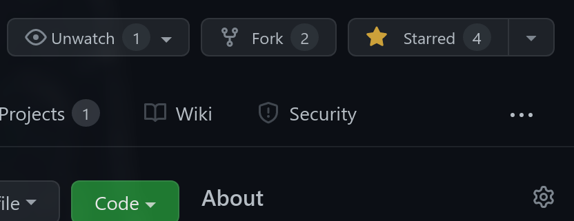

# FakeFileSystem.js 💾

library to simulate a simple file system in javascript 💾

# JsDelivr

```html
<script src="https://cdn.jsdelivr.net/gh/SkwalExe/FakeFileSystem.js@main/src/ffs.min.js"></script>
```

# Usage 📝

The module can be used in Node.js or [in the browser](#jsdelivr).

```bash
npm install --save fakefilesystem
```

```js
const FFS = require('fakefilesystem');

var myFFS = new FFS();
```

# Wiki 📖

### **To learn more about how to use the module, check out the [wiki](https://github.com/SkwalExe/FakeFileSystem.js/wiki). It contains very much a lot of informations**

# final

If you have any problem, don't hesitate to open an issue

# Contributing

Start by **forking** this repository.



Then clone your fork to your local machine.

```git
git clone https://github.com/your-username/[repo].git
```

Create a new branch

```git
git checkout -b super-cool-feature
```

Then make your changes

Once you're done, commit your changes and push them to the remote repository.

```git
git add --all
git commit -m "Add super-cool-feature"
git push origin super-cool-feature
```

Then, open a pull request on GitHub from your fork.

<a href="https://github.com/SkwalExe#ukraine"></a>